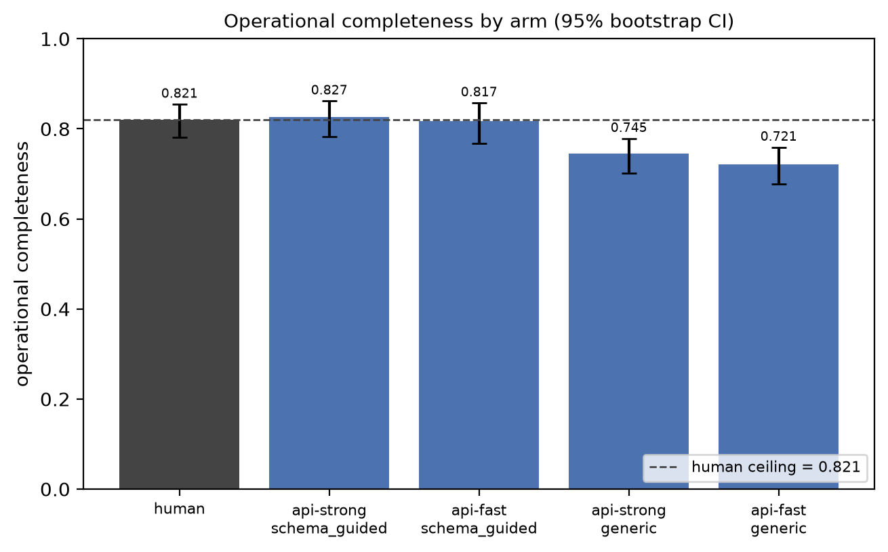

# llm-sitrep-evaluation

**Looking Complete Is Not Being Grounded: Evaluating LLM Sitreps Against
Human-Authored Situation Reports**

Research code and reproducibility materials for the LT4CPR workshop at
AACL-IJCNLP 2026.

[Results ledger](RESULTS.md) | [Reproducibility specification](supplementary/reproducibility/README.md)

## Overview

This project asks whether an LLM-generated crisis situation report can be operationally useful
when its input is limited to social-media posts. We induce a human-adjudicated, 15-slot information
schema from professional humanitarian reports and use it to compare 121 human reports with 261
LLM-generated reports across five disasters and four hazard types.

The central distinction is between **looking complete** and **being grounded**. A report can cover
the expected topics while omitting figures, attribution, and provenance that were unavailable in
the source stream.



## Main Findings

- Under the Gemini judge on Cyclone Idai, the best machine arm is nominally above the empirical
  human ceiling (0.827 vs. 0.821), but the difference is statistically indistinguishable from zero
  (95% bootstrap CI `[-0.049, 0.059]`, permutation `p = 0.852`) and does not replicate under Luna.
- Across the three primary events, machine reports reproduce only 5.4-11.0% of the figures in
  same-day professional reports.
- Issuing provenance, including report date, organisation, series, and authority, has a positive
  human-minus-machine coverage gap in all 12 observed event-judge cells.
- On the three primary events, ROUGE-L is uninformative, BERTScore is negatively associated with
  operational completeness after multiplicity correction, and a generic LLM judge changes sign.
- On a blind 100-item validation sample, the schema author agrees with the Gemini completeness
  judge at 0.910 accuracy and unweighted Cohen's kappa of 0.799.

These are corpus- and judge-scoped measurements, not claims that social media can never contain
operational information or that one model ordering generalises beyond the evaluated events.

## Repository Layout

| Path | Contents |
| --- | --- |
| `paper/` | ACL-format LaTeX source and verified BibTeX bibliography |
| `src/` | Collection, schema induction, generation, judging, analysis, and plotting code |
| `results/` | Committed publication tables, figures, and non-sensitive intermediate results |
| `supplementary/reproducibility/` | Prompts, frozen schema, manifests, measurement specification, and per-judgement tables |
| `tests/` | Unit and release-contract tests |
| `data/processed/schema.yaml` | Human-adjudicated 15-slot schema |
| `config.yaml` | Event-independent pipeline, model, sampling, and cost-gate configuration |
| `RESULTS.md` | Claim-to-table provenance ledger with commands, seeds, and denominators |

Raw report bodies, social-media text, judge evidence spans, API credentials, and generated text
that may repeat personal contact details are intentionally excluded from version control.

## Quick Start

Create an environment and install the Python dependencies:

```bash
python -m venv .venv

# macOS/Linux
source .venv/bin/activate

# Windows PowerShell
# .\.venv\Scripts\Activate.ps1

python -m pip install -r requirements.txt
python -m pytest -q
```

The current release contains 370 tests. The complete package and runtime inventory used for the
paper is recorded in `supplementary/reproducibility/environment.txt`.

## Rebuild Figures

The publication figures can be regenerated from committed, text-free result tables without making
an LLM call:

```bash
python -m src.figures \
  --tables-dir results/tables/paper/idai/gemini \
  --completeness results/tables/idai/gemini/completeness_by_sitrep.csv \
  --reference-metrics results/tables/reference_metrics.csv \
  --correlations results/tables/correlations_gemini.csv
```


## Reproduce the Analysis

The anonymous artifact supports two levels of reproduction:

1. **Deterministic audit:** use the released text-free per-judgement and publication tables to
   recompute reported scores, confidence intervals, agreement statistics, and plots without
   reissuing mutable model calls.
2. **Full regeneration:** reacquire the 125 public ReliefWeb products and the licensed HumAID
   corpus, verify their hashes against the manifests, and reissue calls using the released prompts,
   model-role table, schema, and decoding parameters.

After restoring the inputs described in the [reproducibility specification](supplementary/reproducibility/README.md),
the publication tables and release artifact are produced with:

```bash
python -m src.paper_analysis
python -m src.matcher_audit
python -m src.export_reproducibility
```

Live collection or model calls require a local `.env` file. Copy `.env.example`, add only the
credentials needed for the selected providers, and keep the file out of version control. The LLM
wrapper caches requests, logs non-text provenance, and refuses runs projected to exceed the
configured cost limit.

Provider aliases used in the study are public but mutable. The artifact therefore records model
identifiers, call dates, parameters, request hashes, and served-model strings; it does not promise
bit-identical fresh generations from future provider endpoints.

## Data and Privacy

- ReliefWeb report metadata, retrieval locations, dates, and SHA-256 hashes are released; report
  bodies must be reacquired from their public sources.
- HumAID identifiers, dates, labels, ordering, and text hashes are released without tweet text.
- Machine outputs are represented by hashes and provenance because spot checks found that generated
  reports can repeat phone numbers and email addresses from crisis posts.
- All publication tables and matcher-audit labels in the artifact are text-free.

See `supplementary/reproducibility/README.md` for the exact acquisition order, truncation rule,
measurement definitions, and artifact inventory.

## Citation

Please cite the workshop paper by its title above. Author and proceedings metadata are intentionally
omitted during anonymous review; canonical BibTeX will be added after publication.

